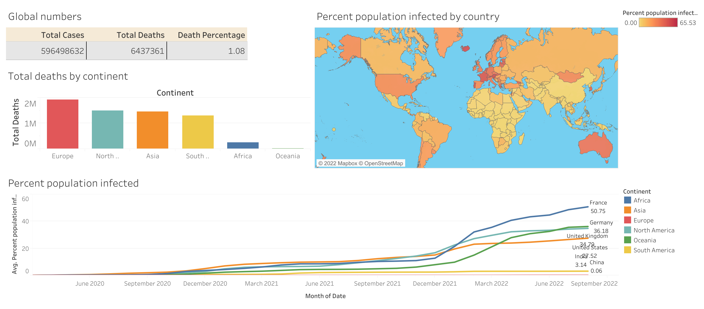

# Global Covid analysis

PostgreSQL data analysis project using data from https://ourworldindata.org/covid-deaths to analyze countries and continents with

- highest death rate per population
- infection rate per population
- vaccinations per population

 

# Tools

This project was created with:
- pgadmin 4
- Tableau Public

 

# About this repo

In this repository you will find:

- **[create_db.sql](create_db.sql)** : creates the SQL database

- **[covidproject.sql](covidproject.sql)** : SQL queries

 

# Tableau dashboard

Click on the image below to see the Tableau dashboard showcasing this project

